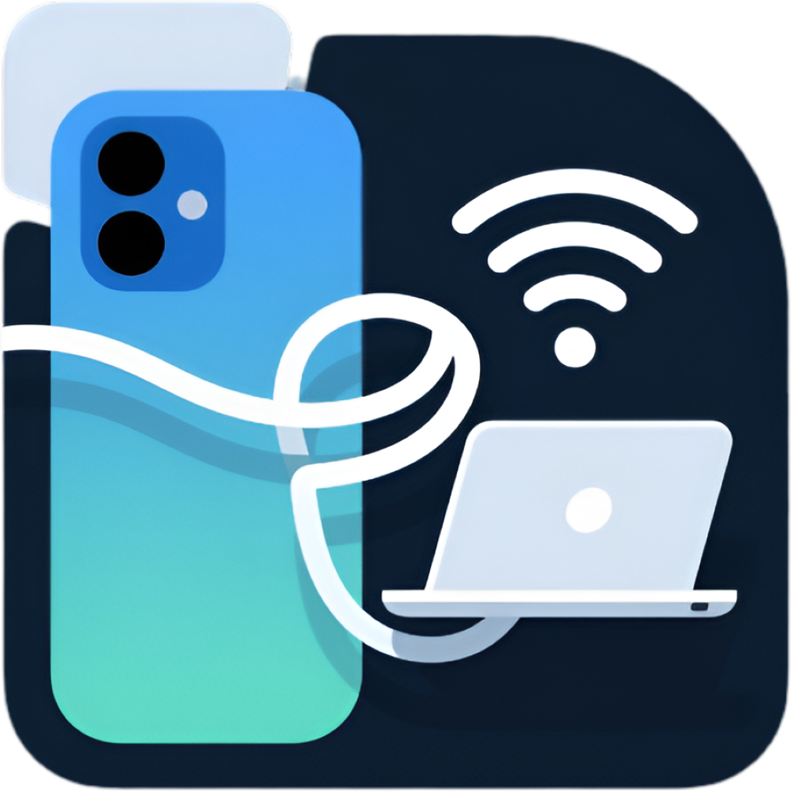
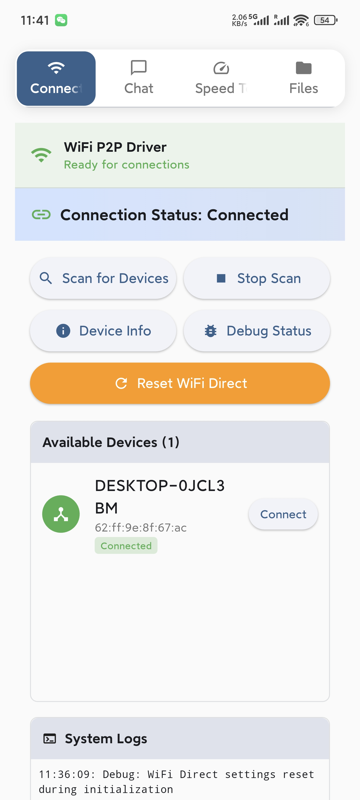
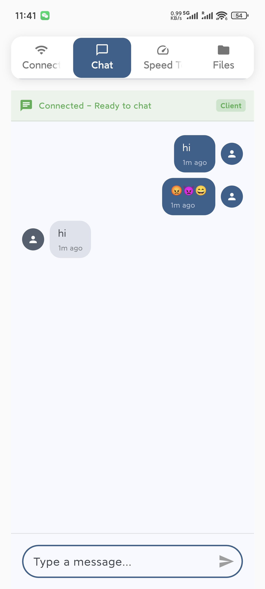
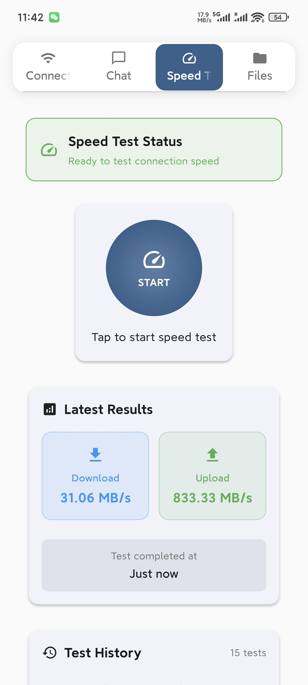
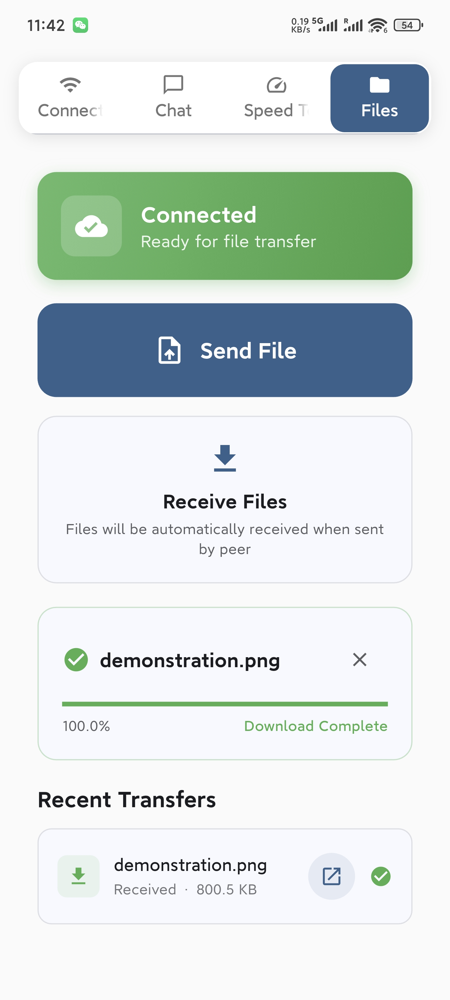
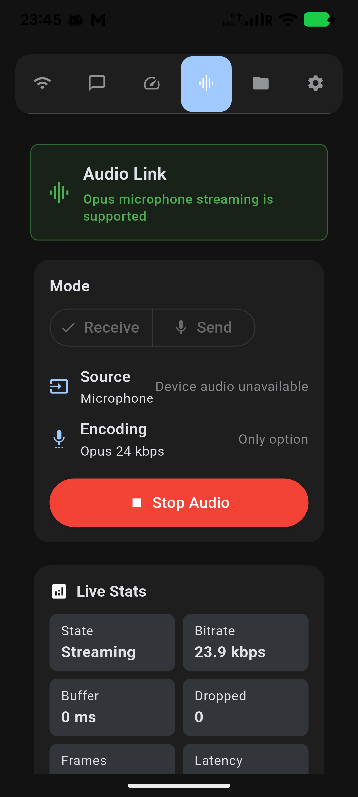
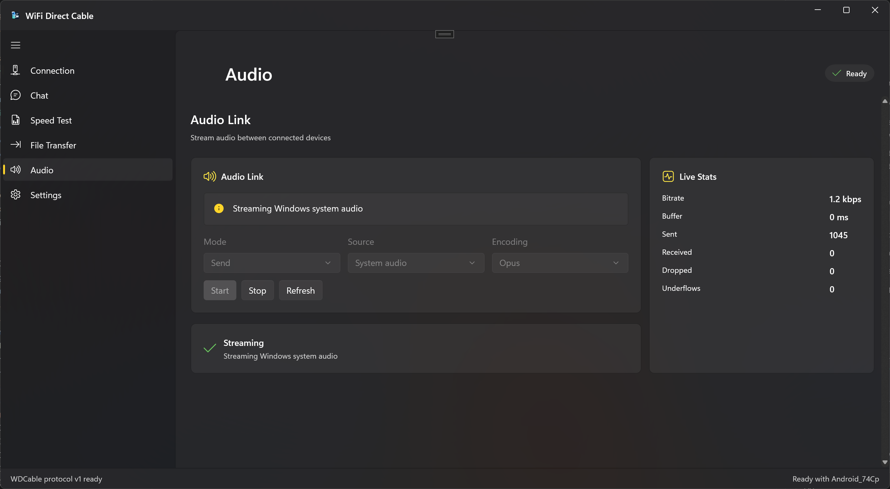

# Khakwani P2P

<p align="center">
  
</p>

<p align="center">
  <strong>Offline peer-to-peer link for files, chat, audio — and a remote SIM gateway — over Wi-Fi Direct.</strong>
</p>

<p align="center">
  No internet. No router. No hotspot. No cloud. No account. Just two phones talking directly.
</p>

<p align="center">
  
  
  
  
  
</p>

---

## What It Does

Khakwani P2P creates a private local link between two nearby Android phones using
Wi-Fi Direct. Once connected, the two devices share one negotiated, **encrypted**
session for chat, file transfer, speed testing, audio — and a **remote SIM
gateway**.

The gateway is the headline feature: **Phone 1 holds the only SIM**, and
**Phone 2 has no SIM at all** yet can dial, answer, hang up and send SMS through
Phone 1, over the direct link, with no internet involved anywhere.

> [!IMPORTANT]
> **This is not a virtual SIM.** Phone 2 never gains cellular identity, never
> registers on a network, and cannot place a call by itself. Every cellular
> action happens on Phone 1, triggered by a remote command.

## Remote SIM Gateway

| | Phone 1 — Gateway | Phone 2 — Client |
| --- | --- | --- |
| SIM | **Yes** | **None** |
| Role | performs every cellular action | sends commands, shows state |
| Shows | pairing code, call state | dialer, messages, diagnostics |

**What works**

- Authenticated, encrypted control channel — AES-256-GCM, P-256 ECDH, HKDF,
  replay protection, per-channel keys
- Code-based pairing, plus a confirmation number both phones display so an
  active man-in-the-middle can be detected
- Gateway status: SIM, carrier, network, signal, mobile data, call state, battery
- Remote dial, answer, reject, hang up, with live call state and duration
- SMS send; SMS read where Android permits it
- Per-device compatibility report and a full diagnostics screen
- Works entirely in aeroplane mode with Wi-Fi on

**What will never work, and why**

- **Remote cellular call audio is not possible.** No supported Android API hands
  an ordinary app the call audio stream, so the conversation stays on Phone 1's
  own speaker and microphone. The app says so, permanently, on the dialer.
- **Reading SMS** needs the app to be the phone's default messaging app.
- **Enabling tethering** cannot be done programmatically by any normal app.
- **Audio Link traffic is not encrypted** by the app layer — it is RTP over UDP,
  protected only by Wi-Fi Direct's own link-layer WPA2.

Nothing is hidden. See [`docs/ANDROID_LIMITATIONS.md`](docs/ANDROID_LIMITATIONS.md).

## Get an APK

**No toolchain needed.** Push this repository to GitHub, open
**Actions → Debug APK → Run workflow**, and download the `wdcable-debug-apk`
artifact. No signing keys, no secrets.

**Or build locally**, with Flutter 3.44.0, a JDK 17+ and the Android SDK:

```powershell
# Windows
.\tools\build_apk.ps1 -Install
```

```sh
# Linux / macOS
./tools/build_apk.sh --install
```

Then follow **[`QUICKSTART.md`](QUICKSTART.md)** — install on both phones, pair,
and make a call.

> [!WARNING]
> **This code has never been compiled.** It was written without a working
> toolchain, so the first build may fail. Both routes above are set up to show
> you exactly which errors. Per-requirement status is in
> [`docs/FUNCTIONAL_GOALS.md`](docs/FUNCTIONAL_GOALS.md).

## Highlights

- Direct device-to-device connection without internet access.
- Remote SIM gateway: dial and message from a phone with no SIM.
- Encrypted, authenticated protocol with pairing and replay protection.
- High-speed file transfer for local sharing.
- Real-time chat between connected peers.
- Low-latency Audio Link using RTP/RTCP over UDP with libopus.
- Selectable audio quality and latency modes.
- Built-in upload and download speed tests.
- UDP rendezvous transport with detailed connection diagnostics.
- Honest per-device compatibility reporting — never "works everywhere".

## Screenshots

| Connection | Chat | Speed Test | File Transfer |
| :---: | :---: | :---: | :---: |
|  |  |  |  |

> The dialer, messages and diagnostics tabs are new and not yet pictured — the
> app has not been run on hardware.

## Audio Link

Use one phone as a mobile microphone sender and the other device as the receiver.
Audio Link streams libopus audio over RTP/RTCP with selectable quality and
latency modes for different network conditions.

| Android Audio Link | Desktop Audio Link |
| :---: | :---: |
|  |  |

Quality presets: Standard (32 kbps), Balanced (64 kbps), High (128 kbps),
Near lossless (256 kbps). Latency modes: Low latency and Stable.

## Documentation

| Document | Covers |
| --- | --- |
| [`QUICKSTART.md`](QUICKSTART.md) | get an APK on two phones and make a call |
| [`docs/FUNCTIONAL_GOALS.md`](docs/FUNCTIONAL_GOALS.md) | every requirement, its status, and how that was checked |
| [`docs/ARCHITECTURE.md`](docs/ARCHITECTURE.md) | the codebase as found, and every change since |
| [`docs/ANDROID_LIMITATIONS.md`](docs/ANDROID_LIMITATIONS.md) | what Android does and does not permit, and why |
| [`docs/PROTOCOL.md`](docs/PROTOCOL.md) | wire format, pairing, key derivation |
| [`docs/WIFI_DIRECT.md`](docs/WIFI_DIRECT.md) | discovery, the UDP rendezvous, ports, state model |
| [`docs/PHONE1_GATEWAY.md`](docs/PHONE1_GATEWAY.md) | setting up and running the gateway phone |
| [`docs/PHONE2_CLIENT.md`](docs/PHONE2_CLIENT.md) | setting up and running the client phone |
| [`docs/TEST_PLAN.md`](docs/TEST_PLAN.md) | automated checks, plus 21 manual two-phone tests |
| [`tools/static_checks/`](tools/static_checks/) | offline checks for defects no compiler catches |

## Platform Support

| Platform | Status |
| --- | --- |
| Android | Android 13+ (API 33), `arm64-v8a` or `x86_64` |
| 32-bit Android | Not supported — no `armeabi-v7a` libopus binary is bundled |
| Emulators | Not usable — Wi-Fi Direct needs two physical phones |

Android 13 is the floor because `WifiP2pManager.startListening`,
`ACTION_WIFI_P2P_REQUEST_RESPONSE_CHANGED` and the `NEARBY_WIFI_DEVICES`
permission path are all API 33.

## Getting Started

### Prerequisites

- Flutter SDK 3.44.0: [installation guide](https://flutter.dev/docs/get-started/install)
- A **JDK** 17 or newer — a JRE is not enough, Gradle needs the compiler
- Android SDK with NDK and CMake (the app bundles libopus through JNI)
- **Two** Android 13+ devices with Wi-Fi Direct

### Run Locally

```sh
flutter pub get
python tools/static_checks/run_all.py   # seconds, catches what compilers miss
flutter analyze
cd android && ./gradlew testDebugUnitTest
cd .. && flutter run
```

## Troubleshooting

- Make sure Wi-Fi is enabled on both devices — not just Wi-Fi Direct.
- Grant nearby-device, phone, microphone and notification permissions when asked.
- Keep both devices on the connection screen while pairing.
- If discovery fails, turn Wi-Fi off and on, then scan again.
- Open the **Diagnostics** tab: it reports the compatibility verdict, whether the
  link is actually encrypted, and the reason behind any unavailable feature.
- If a phone reports *pairing desynchronised*, use
  **Diagnostics → Security → Forget this device** and pair again.
- Sessions dying in the background usually means OEM battery management — exempt
  the app from battery optimisation.

## Contributing

Contributions are welcome. For larger changes, please open an issue first so the
implementation can be discussed before a pull request.

```sh
git checkout -b feature/your-feature
git commit -m "Add your feature"
git push origin feature/your-feature
```

Then open a pull request.

## Credits

Khakwani P2P is built on **[WDCable](https://github.com/jingcjie/WDCable_flutter)**
by Jing Jie, which provides the Wi-Fi Direct transport, the UDP rendezvous, the
Protocol v2 framing and the libopus Audio Link that this project extends. That
work is MIT licensed and the original copyright notice is retained in
[LICENSE](LICENSE).

Audio codec: [libopus](https://opus-codec.org/) 1.6.1, 3-clause BSD — see
`android/app/src/main/jniLibs/OPUS_COPYING.txt`.

## License

Distributed under the MIT License, Copyright (c) 2025 Jing Jie.
See [LICENSE](LICENSE) for more information.
